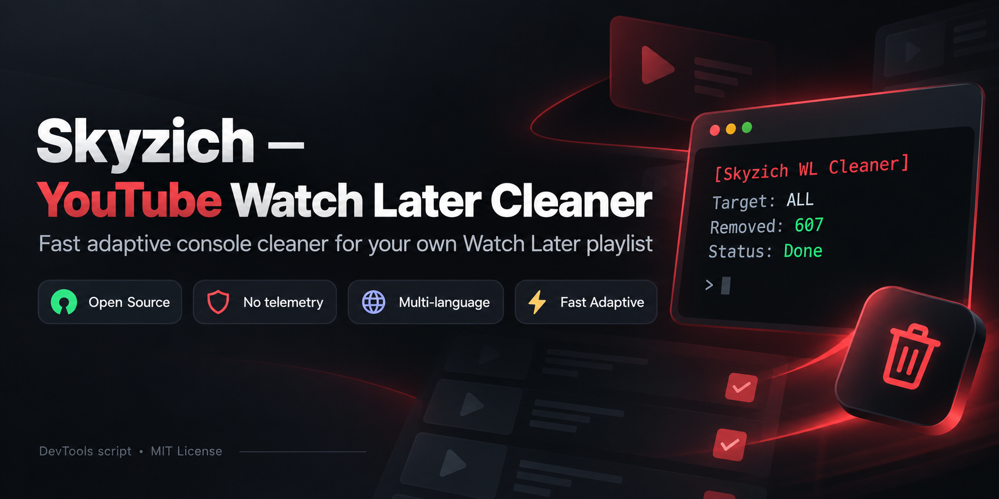

# Skyzich — YouTube Watch Later Cleaner



A fast, adaptive DevTools console script for removing videos from **your own YouTube Watch Later playlist**.

**Author:** Skyzich  
**Version:** 1.1.0  
**License:** MIT  
**Platform:** Desktop YouTube in a modern Chromium/Firefox browser  
**Project status:** Unofficial; not affiliated with, sponsored by, or endorsed by Google or YouTube.

> [!WARNING]
> Removing videos from Watch Later is permanent. There is no automatic undo. Review the source before running any code in your browser's DevTools console.

> [!IMPORTANT]
> This project is intended for personal management of a user's **own** Watch Later playlist. It does not claim that automated use is authorized by YouTube. YouTube's Terms of Service currently include restrictions on accessing the Service using automated means except in specified circumstances. You are responsible for deciding whether your use complies with the Terms and applicable law. See [`DISCLAIMER.md`](DISCLAIMER.md).

## What it does

YouTube's desktop interface lets a signed-in user remove items from Watch Later through each video's menu. This script automates that visible UI flow: it opens the menu, identifies the localized **Remove from Watch Later** command, clicks it, verifies that the row actually disappeared, and then continues.

It does **not** bypass authentication, CAPTCHA, access controls, anti-bot challenges, or rate limits. It does not attempt to conceal automation.

## Features

- Choose an exact number of videos to remove, or enter `ALL`.
- **Fast Adaptive** pacing: runs quickly when YouTube responds normally and backs off on failures.
- Verifies each row was actually removed before continuing.
- Automatic safety stop after repeated failures.
- Strict multi-language matching for many common YouTube interface languages.
- Emergency stop and live status commands.
- No telemetry or analytics.
- No password, cookie, auth-token, localStorage, or sessionStorage access.
- No third-party network requests initiated by the script.

## Quick start

1. Sign in to YouTube on desktop.
2. Open your Watch Later playlist:  
   `https://www.youtube.com/playlist?list=WL`
3. Open DevTools Console:
   - Chrome / Edge: `Ctrl+Shift+J` (Windows/Linux) or `Cmd+Option+J` (macOS)
   - Firefox: `Ctrl+Shift+K` (Windows/Linux) or `Cmd+Option+K` (macOS)
4. Open `watch-later-cleaner.js` from this repository and **review the source**.
5. Copy the entire file and paste it into the console.
6. If Chromium displays a Self-XSS warning that blocks pasting, follow the browser's own on-screen instruction only after you have reviewed and trust the code. Chromium may ask you to manually type `allow pasting`.
7. Press Enter.
8. Enter a number such as `607`, or enter `ALL`.
9. Read the final confirmation and press **OK** to start.

For the fastest and most reliable run, keep the Watch Later tab active and prevent the computer from sleeping. Background-tab throttling can slow browser timers.

## Console controls

Stop after the current UI operation:

```js
SKYZICH_WL.stop()
```

Show current progress:

```js
SKYZICH_WL.status()
```

Refreshing or closing the tab also stops the script.

## Speed and safety

Version 1.1.0 uses **Fast Adaptive** pacing. It starts with a short inter-item delay and can reduce it to roughly 120 ms after confirmed successful removals. Most real-world time is spent waiting for YouTube to render menus and confirm playlist changes.

The script deliberately does **not** remove multiple rows in parallel. YouTube exposes a global popup menu, so concurrent clicks are more likely to target the wrong item or create silent failures.

If YouTube does not confirm an operation, the script slows down automatically. After five consecutive failures it stops rather than continuing blindly.

Actual speed depends on browser performance, network latency, the current YouTube UI, account-side behavior, and whether the tab is active.

## Supported interface languages

The matcher includes rules for many interfaces, including English, Russian, Ukrainian, Belarusian, German, French, Spanish, Portuguese, Italian, Dutch, Polish, Czech, Slovak, Slovenian, Croatian, Serbian, Bosnian, Bulgarian, Romanian, Hungarian, Greek, Turkish, Swedish, Norwegian, Danish, Finnish, Estonian, Latvian, Lithuanian, Indonesian, Malay, Vietnamese, Filipino, Japanese, Korean, Simplified/Traditional Chinese, Hindi, Arabic, Hebrew, and Thai.

This does **not** guarantee every translation or every YouTube A/B-test UI variant. If detection fails, the script stops rather than guessing.

## Privacy and security model

The script itself does not call:

- `fetch()`
- `XMLHttpRequest`
- `WebSocket`
- `navigator.sendBeacon()`
- cookies
- `localStorage`
- `sessionStorage`

It reads the current page's DOM and clicks YouTube's own visible UI controls. **YouTube itself will naturally make network requests when its Remove command is clicked**, just as it does during manual use.

The project should never ask for your Google password, cookies, authentication tokens, recovery codes, API keys, or exported browser profile. If a fork asks for those, do not use it without understanding why.

See [`SECURITY.md`](SECURITY.md) for security reporting guidance.

## Responsible use

This repository is intentionally scoped to personal playlist housekeeping. Contributions should not add features intended to:

- access another person's account or data;
- bypass login, CAPTCHA, access controls, or security mechanisms;
- evade or defeat rate limits or anti-abuse systems;
- scrape credentials, cookies, tokens, or private account data;
- manipulate views, likes, subscribers, comments, or other engagement metrics;
- operate many accounts or conceal automation from the service.

See [`CONTRIBUTING.md`](CONTRIBUTING.md).

## Compatibility notes

The project targets the desktop Watch Later flow where a user opens a video's **More** menu and chooses **Remove from Watch Later**. YouTube can change its DOM structure, component names, accessibility labels, menu rendering, and product behavior at any time. No console automation script can be guaranteed to work forever.

Compatibility target for this release: **desktop YouTube UI, September 2026**.

## Troubleshooting

### `Wrong page`

Open `https://www.youtube.com/playlist?list=WL` and run the script there.

### `Menu button not found`

Refresh YouTube and retry. If the problem persists, YouTube may be serving a new UI variant. Open an issue with your browser, interface language, and the visible menu label. **Do not post cookies, tokens, account IDs, email addresses, or other private data.**

### `Remove-from-Watch-Later command not detected`

Your translation or UI variant may not be included. Open an issue with the exact visible text of the removal menu item and your YouTube interface language.

### The script slows down

That is intentional after failures. It backs off when YouTube does not confirm an operation. Keeping the tab active generally helps.

### Videos reappear after refresh

Stop the run and wait before retrying. This can mean YouTube did not persist some rapid playlist edits even though the page briefly changed.

## Terms, legal notice, and trademarks

This software is provided for general-purpose personal playlist management and educational/open-source use. It is not legal advice and does not provide any guarantee that a particular use is permitted by YouTube or by applicable law.

YouTube's Terms of Service are available at:  
<https://www.youtube.com/static?template=terms>

Read [`DISCLAIMER.md`](DISCLAIMER.md) before publishing or redistributing the project.

YouTube and Google are trademarks of their respective owners. Their names are used only to identify compatibility with the service. This project is not affiliated with, sponsored by, approved by, or endorsed by Google LLC or YouTube.

## Maintenance

This project was created primarily for personal use and is shared publicly in case it is useful to others.

Ongoing maintenance is not guaranteed. I may revisit the project, publish fixes, or add improvements if I have the time and interest to do so, but there is no commitment to provide updates, support, compatibility fixes, new features, or response times.

Bug reports and compatibility feedback are still welcome and may be useful for future revisions if the project is revisited.

Because YouTube can change its interface at any time, the script may stop working partially or completely without notice.

## Publishing

A simple GitHub publishing guide is included in [`PUBLISHING.md`](PUBLISHING.md).

## License

MIT — see [`LICENSE`](LICENSE).
